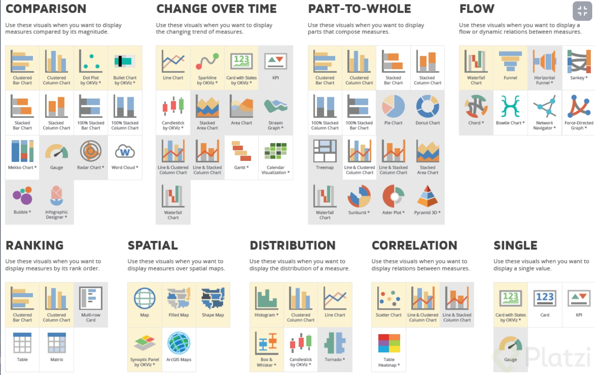

# MATPLOTLIB Y SEABORN

[Version en notion](https://www.notion.so/MATPLOTLIB-Y-SEABORN-596d57a9e75b40f2927bcd7b32f74670) 

## INTRODUCCIÓN

### La importancia de la visualización de datos

Visualizar los datos te da respuestas a preguntas que ni siquiera tenías. La visualización de datos es importante porque:

- Te permite entender a profundidad tendencias, valores o patrones de datos representados a través de representación gráfica de la información.
- Permite mayor contexto. Por ejemplo, al visualizar los datos de manera gráfica, usando un dataset, puedes ver representaciones diferentes a pesar de tener la misma información.
- Permite hallazgos en nuestros datos directamente y de manera muy sencilla, como por ejemplo:
    - Hallar tendencias
    - Comportamientos
    - Detectar Outliers
- Permite mayor claridad en el código. También se utiliza en la ciencia de datos orientada hacia el machine learning o inteligencia artificial, como las líneas de entrenamiento.

### Librerías para visualización de datos

Encontraremos 2 librerías muy importantes para empezar:

- Mayplotlib: Creada en 2003, escrita por John D. Hunter.
    - Emula los comandos de Matlab
    - Usa NumPy
    - Escrita en Python
    - Es muy simple de escribir
    - Rápida
    - Personalizada
- Seaborn:
    - Librería montada sobre Matplotlib

TIP: *Puedes usar ’ ; ’ al final de la linea de código para remplazar el 'plt.show()'*



# MATPLOTLIB

## PYPLOT

Pyplot es una herramienta que tiene Matplotlib para ejecutar gráficas de manera sencilla.

### Creando nuestra primera gráfica

1. Importamos Matplotlib y Pandas
    
    ```python
    import matplotlib.pyplot as plt
    import numpy as np
    ```
    
2. Creamos nuestras variables
    
    ```python
    x = linspace(0,5,11)
    --> [0. , 0.5, 1. , 1.5 ,2. , 2.5, 3.,  3.5, 4.,  4.5, 5. ]
    y = x ** 2
    --> [ 0.  ,  0.25,  1.  ,  2.25,  4.  ,  6.25,  9.  , 12.25, 16.  ,20.25, 25.]
    ```
    
- Graficar en función de y
    
    ```python
    plt.plot(x,y)
    plt.show()
    ```
    
    
    

### Modificar gráficas usando Pyplot

- Cambiar el color de la gráfica
    
    
    | Character | color |
    | --- | --- |
    | ‘b’ | blue |
    | ‘g’ | green |
    | ‘m’ | magenta |
    
    ```python
    plt.plot(x,y,'m')
    plt.show()
    ```
    
    
    
- Cambiar más parámetros
    - Format String
        
        
        | character | description |
        | --- | --- |
        | ‘.’ | point marker |
        | ‘,’ | pixel marker |
        | ‘o’ | circle marker |
        | ‘v’ | triangle_down marker |
        | ‘^’ | triangle_up marker |
        | ‘<’ | triangle_left marker |
        | ‘>’ | triangle_right marker |
    - Line Styles
        
        
        | character | description |
        | --- | --- |
        | ‘-’ | solid line style |
        | ‘–’ | dashed line style |
        | ‘-.’ | dash-dot line style |
        | ‘:’ | dotted line style |
    
    ```python
    plt.plot(x,y, 'yD:') 
    #grafica de color amarillo, con diamantes y puntos consecutivos
    plt.show()
    ```
    
    
    

### Creando diferentes tipos de gráficas

- Crear histograma
    
    ```python
    plt.hist(y)  #histograma de los valores de y
    plt.show()
    ```
    
    
    
- Crear gráfica de pie
    
    ```python
    plt.pie(y)
    plt.show()
    ```
    
- Conocer correlación entre variables (gráfico de dispersión)
    
    ```python
    plt.scatter(x,y)  #correlacion entre la variable x e y
    plt.show()
    ```
    
    
    
- Distribución de los datos: gráfico de caja
    
    ```python
    plt.boxplot(x)
    plt.show()
    ```
    
    
    

## SUBPLOT

Subplot permite crear gráficos dentro de una gráfica (permite tener varios gráficos). Esto lo hace a través de una matriz de gráficos y se puede acceder a ellos a través de índices

### Cómo acceder a la matriz de gráficos en Subplot

```python
import matplotlib.pyplot as plt
import numpy as np

x = np.linspace(0,5,11)
y = x ** 2
```

### Parámetros en Subplot

funcionan:

| Filas | Columnas | Index |
| --- | --- | --- |
- Crear fila y dos columnas
    - Crear una matriz de gráficos de una fila y dos columnas:
        
        ```python
        plt.subplot(*Numero_filas*,*Numero_columnas*,*Index_entre_filas_y_columnas*)
        
        plt.subplot(1,2,1) # Grafico 1
        plt.plot(x,y, 'r--') 
        
        plt.subplot(1,2,2)  # Gráfico 2
        plt.pie(y)
        plt.show()
        ```
        
        
        
    - Agregar diferentes Plot al gráfico
        
        ```python
        plt.subplot(1,2,1)
        plt.plot(x,y, 'r--') # Plot 1
        plt.plot(y,x, 'b:') #Plot 2
        
        plt.subplot(1,2,2)
        plt.pie(y)
        plt.show()
        ```
        
        
        
    - Invertir la matriz de los gráficos
        
        ```python
        plt.subplot(2,1,1) #Grafico 1
        plt.plot(x,y,'r--') #Plot 1
        plt.plot(y,x,'b:')  #Plot 2
        
        plt.subplot(2,1,2) #Grafico 2
        plt.pie(y)         #Plot 1  
        plt.show()
        ```
        
        
        

## MÉTODO ORIENTADO A OBJETOS

Podemos hacer gráficas con pyplot como vimos anteriormente, sin embargo, es muy complicado personalizarla y entrar a ciertos parámetros.

Un objeto define una figura, esa figura es un lienzo en el cual podemos introducir diferentes gráficas(axes), de las cuales cada una posee sus propios ejes(axis).

La figura representa el todo, dentro de ella vamos a configurar gráficas las cuales contienen diferentes ejes.

Es un poco más complicado, pero en el mismo gráfico podemos personalizarlo mucho mejor.

Su estructura es:


### Diferencias entre Pyplot y Object Oriented

| Pyplot | Object Oriented |
| --- | --- |
| Rápido | Mayor personalización |
| Fácil | Más código |
| Una sola figura | Más amigable a múltiples diagramas |

### Implementar el método orientado a objetos para graficar en Matplotlib

```python
import matplotlib.pyplot as plt
import numpy as np

x = np.linspace(0,5,11)
y = x ** 2
```

- Parámetro de axes:
    
    
    | Posición Eje x | Posición Eje y | Size graph eje x | Size graph eje y |
    | --- | --- | --- | --- |
    
    ```python
    fig = plt.figure() #Definir una figura o lienzo
    axes = fig.add_axes([*valor_1*,*valor_2*,*valor_3*,*valor_4*]) 
    #las gráficas se van a llamar axes
    	##donde valor_1 y valor_2 hacen referencia a la posición en la figura
    	## y valor_3 es el tamaño hacia la derecha de la figura y
    	##valor_4 es el tamaño hacia abajo de la figura.
    ```
    
- Utilizamos el concepto de objeto para crear una gráfica más personalizable. Empezamos creando nuestra figura (lienzo donde vamos a dibujar nuestra gráfica).
    
    ```python
    fig = plt.figure() #Definir una figura o lienzo
    axes = fig.add_axes([0.1,0.1,0.5,0.9]) 
    axes.plot(x,y, 'b')
    plt.show()
    ```
    
    
    
- Podemos crear varias gráficas dentro del lienzo llamando el método fig
    
    ```python
    fig = plt.figure()
    axes = fig.add_axes([0.1,0.1,0.8,0.9])
    axes2 = fig.add_axes([0.17,0.55,0.4,0.3])
    
    axes.plot(x,y, 'b')
    axes2.plot(y,x, 'r:')
    axes2.set_facecolor('grey')
    plt.show()
    	#axes y axes2 son objetos totalmente distintos pero que reposan en una
    	#misma figura o lienzo
    ```
    
    
    

## SUBPLOTS

Con subplots se puede trabajar en un arreglo de gráficas a las cuales se accede a través de los índices. Sirve para lo mismo que Subplot, solo que este aprovecha las bondades de trabajar con el método orientado a objetos de Matplotlib.

### Cómo trabajar con subplots para graficar

1. Creamos los datos que vamos a utilizar
    
    ```python
    import matplotlib.pyplot as plt
    import numpy as np
    
    x = np.linspace(0,5,11)
    y = x**2
    ```
    
- Crear una gráfica tipo Fig
    
    ```python
    fig, axes = plt.subplots()
    axes.plot(x,y)
    plt.show()
    ```
    
- Varias gráficas tipo fig
    
    ```python
    fig, axes = plt.subplots(nrows=1, ncols=2) #esto crea una fila con dos columnas
    ## Esto hace referencia a los gráficos que se encuentran dentro de la figura
    ##fig va a devolver un objeto de tipo figura pero con axes va a devolver
    ##un array al que puedo ingresar
    axes[0].plot(x,y,'b')
    axes[1].plot(y,x,'r')
    plt.show()
    ```
    
    
    
- Acceder a los gráficos mediante el nombre almacenado en una tupla
    
    ```python
    fig, (axes1,axes2) = plt.subplots(nrows=1, ncols=2)
    axes1.plot(x,y,'b')
    axes2.plot(y,x,'r')
    plt.show() ##saca la misma gráfica de arriba
    ```
    

### Generar una matriz de tipo fig, con dos filas y cuatro columnas

```python
fig, axes = plt.subplots(*Numero_filas*,*Numero_columnas*)
```

```python
fig, axes = plt.subplots(2,4)

#genera un trazo accediendo a las graficas a traves del indice de la matriz
axes[0,0].plot(x,y)
axes[0,1].plot(y,x, 'r')

fig.tight_layout() #mejora la visualización de los ejes de cada gráfico
```


- Alternativa para generar una matriz de tipo fig, accediendo a cada gráfica mediante los nombres dados en una tupla.
    
    ```python
    fig, ((ax1, ax2, ax3, ax4), (ax5, ax6, ax7, ax8)) = plt.subplots(2,4)
    ax1.plot(x, np.sin(x), 'b')
    ax2.plot(y, np.cos(x), 'purple')
    ax3.plot(x, np.tan(y), 'orange')
    ax4.plot(y, np.cos(y)**2, 'black')
    
    #mejorar la visualización de las figuras:
    fig.tight_layout()
    ```
    
    
    

## LEYENDAS, ETIQUETAS, TÍTULOS, TAMAÑO

Para dar contexto amplio a nuestros gráficos necesitamos usar títulos, leyendas, tamaño o etiquetas.

### Cómo dar contexto a los gráficos

Primero creamos nuestras gráficas comunes

```python
fig, (ax1,ax2) = plt.subplots(1,2)
ax1.plot(x,y, 'b')
ax2.plot(y,x, 'r')
plt.show()
```

- Títulos:
    
    ```python
    fig, (ax1,ax2) = plt.subplots(1,2)
    ax1.plot(x,y, 'b')
    ax1.set_title("Relacion X - Y")
    
    ax2.plot(y,x, 'r')
    ax2.set_title("Relacion Y - X")
    ```
    
    
    
- Etiquetas: agrega labels en los ejes
    
    ```python
    fig, (ax1,ax2) = plt.subplots(1,2)
    ax1.plot(x,y, 'b', )
    ax1.set_title("Relacion X - Y")
    ax1.set_xlabel("X")
    ax1.set_ylabel("Y")
    
    ax2.plot(y,x, 'r')
    ax2.set_title("Relacion Y - X")
    ax2.set_xlabel("Y")
    ax2.set_ylabel("X")
    ```
    
    
    
- Cambiar el tamaño a las figuras:
    
    ```python
    fig, (ax1,ax2) = plt.subplots(1,2, figsize= (10,2))
    ```
    
    
    
- Aplicar etiquetas (por defecto pone la mejor opción):
    
    ```python
    fig, (ax1,ax2) = plt.subplots(1,2)
    ax1.plot(x,y, 'b', label = "sin(x)")
    ax1.set_title("Relacion X - Y")
    ax1.set_xlabel("X")
    ax1.set_ylabel("Y")
    ax1.legend()
    ```
    
    
    
    - Con el simbolo $ puedo dejar una anotación matemática
        
        ```python
        ...
        ax1.plot(x,y, 'b', label = "$sin(x)$")
        ...
        ```
        
- Modificar la localización de la etiqueta:
    
    ```python
    ax1.legend(loc = "upper center")
    ```
    
    
    
- Otras ubicaciones:
    - upper right
    - upper left
    - lower left
    - lower right
    - right

Más información:

[matplotlib.pyplot.legend - Matplotlib 3.6.3 documentation](https://matplotlib.org/stable/api/_as_gen/matplotlib.pyplot.legend.html)

## COLORES Y ESTILOS

### Cómo agregar colores y estilos en Matplotlib

- Estilos de gráficas que hay
    
    ```python
    print(plt.style.available)
    ---> Muestra los estilos que tiene matplot
    ```
    
- Estio de grilla
    
    ```python
    plt.style.use('seaborn-whitegrid')
    ```
    
    
    

### Personalizar colores y estilos en Matlab

```python
fig, ax = plt.subplots(figsize = (6,6))
ax.plot(x,x+1, 'r--')
ax.plot(x,x+2, 'bo-')
ax.plot(x,x+3, 'g.:')
ax.plot(x,x+4, 'purple')
```


### Personalizar colores y estilos en Pyplot

Para personalizar con pyplot es un poco más largo cuando programamos, pero se puede personalizar muchísimo más

- color
    
    ```python
    fig, ax = plt.subplots(figsize = (6,6))
    ax.plot(x,x+1,color = '#D426C8') ---> Color RGB
    ax.plot(x,x+2,color = '#66FF89')
    
    ax.plot(x,x+3,color = 'blue') --> Color común
    ax.plot(x,x+4, color = 'black')
    ```
    
    
    
- Transparencia `(alpha)` y grosor `(linewidth)`
    
    ```python
    fig, ax = plt.subplots(figsize = (6,6))
    ax.plot(x,x+1,color = '#D426C8', alpha= 0.5, linewidth= 18)
    ax.plot(x,x+2,color = '#66FF89', linewidth= 3)
    ax.plot(x,x+3,color = 'blue', linewidth= 5)
    ax.plot(x,x+4, color = 'black', alpha = 0.3, linewidth= 12)
    ```
    
    
    
- Estilo de línea `(linestyle)` y marcadores `(marker)`
    
    ```python
    fig, ax = plt.subplots(figsize = (6,6))
    ax.plot(x,x+3,color = 'blue', linestyle = 'dashed', marker = 'x')
    ax.plot(x,x+4, color = 'black',linestyle = '--', marker = 'P')
    ```
    
    
    
- Tamaño de marcadores `(markersize)` y color de ese marker `(markerfacecolor)`
    
    ```python
    fig, ax = plt.subplots(figsize = (6,6))
    ax.plot(x,x+3,color = 'blue', linestyle = 'dashed', marker = '8', markersize = 10, markerfacecolor= "#37D842")
    
    ax.plot(x,x+4, color = 'black',linestyle = '--', marker = 'P', markerfacecolor="#FF0000")
    ```
    
    
    

Más colores y estilos:

[Specifying colors - Matplotlib 3.6.3 documentation](https://matplotlib.org/3.5.1/tutorials/colors/colors.html)

## BAR PLOT

El gráfico de barras nos permite graficar variables categóricas, es decir, variables de texto, lo que es muy importante en el mundo de la ciencia de datos y Matplotlib ofrece ciertas características que nos facilita la vida en cuanto a graficar este tipo de variables.

### Cómo empezar a crear Bar Plot

1. Importamos librerías
    
    ```python
    import matplotlib.pyplot as plt
    import numpy as np
    ```
    
2. Variables categóricas
    
    ```python
    countries = ["INDIA", "JAPAN", "MEXICO", "COLOMBIA", 'GERMANY']
    population = [5000, 800, 900, 1000, 300]
    ```
    
3. Gráfica de barras
    
    ```python
    plt.bar(countries,population)
    plt.show()
    ```
    
    
    
- Modificar colores y tamaño
    
    ```python
    plt.bar(countrys,population,  width=0.5, color= ["aqua", "grey", "teal", "crimson", "violet"])
    plt.show()
    ```
    
    
    
- Modificar los nombres de las variables en el eje X con `xticks`
    
    ```python
    plt.bar(countrys,population, width=0.5, color= ["aqua", "grey", "teal", "crimson", "violet"])
    plt.xticks(np.arange(5), ('India','Japon', 'Mexico', 'Colombia', 'Alemania'), rotation = 45)
    plt.show()
    ```
    
    
    
- Crear un gráfico de manera horizontal con `barh`
    
    ```python
    plt.barh(countrys,population)
    plt.show()
    ```
    
    
    

Más opciones con bar plot:

[matplotlib.pyplot.bar - Matplotlib 3.6.3 documentation](https://matplotlib.org/stable/api/_as_gen/matplotlib.pyplot.bar.html)

## CREAR OTROS TIPOS DE GRÁFICOS EN MATPLOTLIB

Para cada gráfico usamos los siguientes datos a modo de ejemplo

```python
data = np.random.randint(1,50,100)
```

### Gráfico tipo histograma

Muy útil para analizar distribución y frecuencia

```python
plt.hist(data)
plt.show()
```


- Número de barras con `bins`. Bins es el número de barras en el cual va a llegar la distribución de datos. Es el parámetro principal de los histogramas
    
    ```python
    plt.hist(data, bins=50)
    plt.show()
    ```
    
    
    
- Cambiar estilo
    
    ```python
    plt.hist(data, bins=10, histtype='step') 
    plt.show()
    ```
    
    
    

### Gráfico tipo Boxplot

O gráfico de cajas

```python
plt.boxplot(data)  #Muestra rango intercuartil y la mediana
plt.show()
```


- Cambiar dirección `(vert=False)`, rellenar el rango inter cuartil `(patch_artist)` y enfocar la mediana `(notch)`
    
    ```python
    plt.boxplot(data, vert=False, patch_artist=True, notch=True)
    plt.show()
    ```
    
    
    
- Quitar Outliers `(showfliers)`
    
    ```python
    data = np.append(data, 200) #Aquí estamos agregando el dato outlier
    ```
    
    
    
    ```python
    plt.boxplot(data, vert=False, patch_artist=True, notch=True, showfliers=False)  
    plt.show()
    ```
    
    
    

### Gráfico tipo Scatter

También llamado gráfico de dispersión.

Cargamos los siguientes datos para los ejemplos

```python
N = 50
x = np.random.rand(N)
y = np.random.rand(N)
area = (30 * np.random.rand(N)) **2
colors = np.random.rand(N)
```

- Scatter normal:
    
    ```python
    plt.scatter(x,y)
    plt.show()
    ```
    
    
    
- Scatter con área:
    
    ```python
    plt.scatter(x,y, s=area)
    plt.show()
    ##El tamaño que tenga en cada una de las burbujas va a hacer referencia a 
    ##la variable area.
    ```
    
    
    
- Color y marker
    
    ```python
    plt.scatter(x,y, s=area, c= colors, marker = 'v') # cambiar el marker
    plt.show()
    ```
    
    
    
- Transparencia para ver los superpuestos
    
    ```python
    plt.scatter(x,y, s=area, c= colors, marker = 'o', alpha= 0.5) # transparencia
    plt.show()
    ```
    
    
    

Otros gráficos:

[Examples - Matplotlib 3.6.3 documentation](https://matplotlib.org/stable/gallery/index.html)

# SEABORN

Seaborn es una librería construida sobre Matplotlib, por l que hereda todas las bondades de la misma. Escrita por Michael Waskom y está integrada para estructuras de Pandas por lo que está optimizada para funcionar con DataFrames.

### Ventajas

- Tiene una gran velocidad
- Facilidad para escribir código
- Altamente customamizable entre gráficas y visualizaciones

### Estructura básica

```python
sns.'Tipo de Grafica'(
		 data='Dataset',
		 x='Data en el eje x',
		 y='Data en el eje y',
		 hue='Variable de agrupamiento')
```

### Tipos de gráficas

Seaborn ofrece ciertas características principales para problemas específicos de visualización de datos:

- Diagramas o gráficas relacionables
- Distribución de datos
- Graficar variables categóricas

Por ejemplo:

- **Relplot (relacional):** scatterplot, lineplot.
- **Displot (distribuciones):** histplot, kdeplot, ecdfplot, rugplot.
- **Catplot (categorica):** stripplot, swamplot, boxplot, violinplot, pointplot, barplot.

## SET

Set es un método de Seaborn que permite configurar el estilo, fuente y color de las gráficas.

### Cómo usar y qué necesitas saber al usar Set

```python
import seaborn as sns
import matplotlib.pyplot as plt
```

- Este parámetro afecta a todas las gráficas que creamos, incluidas las que no usan Seaborn
- Podemos resetear los valores utilizando el método `reset_orig`
- Este parámetro es un atajo de `set_theme`, que es el recomendado según la documentación.

### Crear gráficas de Barplot

Podemos hacerlo utilizando el siguiente código:

```python
sns.barplot(x=['A','B','C'], y=[1,3,2])
plt.show()
```


### Configurar fuentes y estilos

- Configura el estilo, la paleta de colores, la fuentes y el tamaño de la fuente de la gráfica
    
    ```python
    sns.set(style='dark', palette='dark', font="Verdana", font_scale=1)
    sns.barplot(x=['A','B','C'], y=[1,3,2])
    plt.show()
    ```
    
    
    

Paleta de colores:

[seaborn.color_palette - seaborn 0.12.2 documentation](https://seaborn.pydata.org/generated/seaborn.color_palette.html#seaborn.color_palette)

Temas:

[seaborn.set_theme - seaborn 0.12.2 documentation](https://seaborn.pydata.org/generated/seaborn.set_theme.html#seaborn.set_theme)

### Parámetros más usados con Seaborn

Seaborn tiene ciertos parámetros para cada gráfico, estos son los más comunes:

Primero importamos las librerías y el Dataset que vamos a usar:

```python
import seaborn as sns
import matplotlib.pyplot as plt

tips = sns.load_dataset('tips') ---> Dataset de seaborn
tips
```

- Gráfico de frecuencia para el total de la cuenta
    
    
    | Tipo de gráfica | Dataset | X |
    | --- | --- | --- |
    | .displot | tips | ‘total_bill’ |
    1. 
    
    ```python
    sns.displot(data= tips, x= 'total_bill');
    ```
    
    
    
    - Agregamos una variable ‘Y’, pero seaborn reconoce que en gráfico de frecuencias no es la mejor opción y lo adapta automáticamente
        
        ```python
        sns.displot(data= tips, x= 'total_bill', y= 'tip');
        ```
        
        
        
    - Hacer agrupamiento por una variable `hue`
        
        ```python
        sns.displot(data= tips, x= 'total_bill', y= 'tip', hue = 'sex');
        ```
        
        
        
    - Cambiar el tipo de gráfica con `kind`
        
        ```python
        sns.displot(data= tips, x= 'total_bill', hue = 'sex', kind = 'kde');
        ```
        
        
        
    - Quitar la legenda, cambiar la paleta de colores y su transparencia
        
        ```python
        sns.displot(data= tips, x= 'total_bill', hue = 'sex', kind = 'kde', legend= False, palette='dark', alpha = .5);
        ```
        
        
        
    
    Mas: 
    
    [seaborn.load_dataset - seaborn 0.12.2 documentation](https://seaborn.pydata.org/generated/seaborn.load_dataset.html)
    

## DISTRIBUCIONES

Seaborn ofrece algunas gráficas u opciones que te permiten trabajar con distribuciones orientadas a tipos de datos numéricos.

### Uso de .kde y .displot para graficar distribuciones

- Gráfico para distribuciones y que se acumulen `(cumulative)`
    
    ```python
    sns.histplot(data = tips, x= 'tip', bins = 15, cumulative=True)
    ```
    
    
    
- Como muestra en el eje y `stat` (hay varias opciones como frecuencia, probabilidad, percentil, densidad, etc), presentar los datos `multiple` (como quiero presentar mis datos)
    
    ```python
    sns.histplot(data = tips, x= 'tip', bins = 15, hue= 'sex', stat = 'density', multiple= 'dodge');
    ```
    
    
    

### Uso de .kde

Gráfica de densidad

```python
sns.kdeplot(data=tips, x='tip', hue='sex');
```


- Con acumulación
    
    ```python
    sns.kdeplot(data=tips, x='tip', hue='sex', cumulative=True);
    ```
    
    
    
- Crear una área debajo de la curva
    
    ```python
    sns.kdeplot(data=tips, x='tip', hue='sex', shade=True);
    ```
    
    
    
- Ajusta directamente la gráfica y los parámetros que estamos manejando en los ejes
    
    ```python
    sns.kdeplot(data=tips, x='tip', hue='sex', shade=True,bw_adjust=1)
    ```
    
    
    

### Uso de .displot

Gráfica de distribución

- Cambiar tipo de gráfica con `kind`
    
    ```python
    sns.displot(data = tips, x = 'tip', hue = 'sex',kind= 'hist', multiple= 'stack');
    ```
    
    
    

Más gráficos de distribuciones:

[Visualizing distributions of data - seaborn 0.12.2 documentation](https://seaborn.pydata.org/tutorial/distributions.html)

## CATEGÓRICOS

Seaborn ofrece diferentes gráficos para graficar datos categóricos o variables de texto.

### Tipos de datos categóricos

Empecemos importando los datos que necesitas de las librerías

```python
import seaborn as sns
import matplotlib.pyplot as plt 

tips = sns.load_dataset('tips')
tips.head(2)
```

- Gráfica de cantidad:
    
    ```python
    sns.countplot(data = tips, x= 'day', hue='sex');
    ```
    
    
    
- Diagrama de puntos: En este vamos a tener un eje horizontal donde se están concentrando más los datos.
    
    ```python
    sns.swarmplot(data= tips, x= 'day', y = 'total_bill', hue= 'sex', dodge=True);
    ```
    
    
    
- Diagrama de caja: también funciona con variables completamente numéricas
    
    ```python
    sns.boxplot(data= tips, x= 'day', y = 'total_bill', hue= 'sex', dodge=True);
    ```
    
    
    
- Combinando distintos gráficos:
    
    ```python
    sns.boxplot(data= tips, x= 'day', y = 'total_bill', hue= 'sex', dodge=True);
    sns.swarmplot(data= tips, x= 'day', y = 'total_bill', hue= 'sex', dodge=True, color = '0', marker= '<');
    ```
    
    
    
- Violín: parecido a Boxplot, pero no muestra los cuartiles, sino como se concentran los datos en comparación. Con `(split)` combina los datos
    
    ```python
    sns.violinplot(data= tips, x= 'day', y = 'total_bill', hue= 'sex', split=True);
    ```
    
    
    
- Catplot, con `kind` podemos cambiar el tipo de gráfico y se puede agregar otra variable con `col`. Catplot grafica únicamente variables categóricas.
    
    ```python
    sns.catplot(data= tips, x= 'day', y = 'total_bill', hue= 'sex', dodge=True, kind= 'box', col= 'time');
    ```
    
    
    
    Con solo cambiar el dato en col puedo acceder a todos los gráficos categóricos con los que puedo trabajar.
    
    Más gráficos categóricos:
    
    [Visualizing categorical data - seaborn 0.12.2 documentation](https://seaborn.pydata.org/tutorial/categorical.html)
    

## RELACIÓN

Seaborn maneja los gráficos de relación o correlación entre distintas variables numéricas para hacer visualizaciones.

### Tipos de gráficos de relación

Empecemos importando los datos para empezar a graficar

```python
import seaborn as sns
import matplotlib.pyplot as plt 

tips = sns.load_dataset('tips')
tips.head(2)
```

- Scatter
    
    ```python
    sns.scatterplot(data= tips, x= 'total_bill', y = 'tip', hue= 'day');
    #muestra la relación esntre el total de la cuenta y las propinas
    ```
    
    
    
    - Cambiar el estilo de los puntos y su tamaño
        
        ```python
        sns.scatterplot(data= tips, x= 'total_bill', y = 'tip', hue= 'day', style= 'time', size='size');
        plt.legend(loc= 'center', bbox_to_anchor= (1.12, 0.5)) #estamos ubicando la leyenda
        ```
        
        
        
    - Cambiar el formato de los marcadores
        
        ```python
        markers = {"Lunch": 'D', "Dinner": 's'}
        sns.scatterplot(data= tips, x= 'total_bill', y = 'tip', hue= 'day', style= 'time', size='size', markers = markers);
        plt.legend(loc= 'center', bbox_to_anchor= (1.12, 0.5));
        ```
        
        
        
- Line
    
    ```python
    sns.lineplot(data= tips, x= 'total_bill', y = 'tip',  hue= 'day', style= 'time', size='size');
    ```
    
    
    
- Relplot
    - Con `kind` podemos modificar el tipo de gráfico
        
        ```python
        sns.relplot(data= tips, x= 'total_bill', y = 'tip',  hue= 'day', style= 'time', size='size', kind= 'line');
        ```
        
        
        
    - Agregar el formato col
        
        ```python
        sns.relplot(data= tips, x= 'total_bill', y = 'tip',  hue= 'day', style= 'time', size='size', kind= 'scatter', col = 'time');
        ```
        
        
        
    
    Relplot:
    
    [seaborn.relplot - seaborn 0.12.2 documentation](https://seaborn.pydata.org/generated/seaborn.relplot.html)
    

## JOINTPLOT Y PAIRPLOT

Son funcionalidades de Seaborn, porque con un solo comando se puede generar varios tipos de gráficos.

Para jointplpot y pairplot importamos los siguientes datos:

```python
import seaborn as sns
import matplotlib.pyplot as plt

tips = sns.load_dataset('tips')
tips.head()
```

### Jointplot

Jointplot une 2 distintas gráficas en una sola

```python
sns.jointplot(data=tips, x='total_bill', y= 'tip', hue = 'sex');
```


- Agregar más argumentos para poder hacer un mejor análisis
    
    ```python
    sns.jointplot(data=tips, x='total_bill', y= 'tip', hue='sex', kind= 'hist', marginal_ticks=True, #muestra una pequeña tabla para la gráfica exterior
    marginal_kws=dict(bins= 25, fill = True, multiple= 'dodge')); #marginal_kws se le pueden agregar diferentes parámetros
    ```
    
    
    

Más información de jointplot:

[seaborn.jointplot - seaborn 0.12.2 documentation](https://seaborn.pydata.org/generated/seaborn.jointplot.html)

### Pairplot

Pairplot correlaciona todas las variables numéricas que hay en el dataset

```python
sns.pairplot(data= tips);
```


- Solo muestra una esquina del pairplot, eliminando así, las gráficas repetidas
    
    ```python
    sns.pairplot(data= tips, corner=True);
    ```
    
    
    

Más información de pairplot:

[seaborn.pairplot - seaborn 0.12.2 documentation](https://seaborn.pydata.org/generated/seaborn.pairplot.html)

## HEATMAP

Heatmap es un tipo de gráfico enfocado a una estructura matricial. Heatmap correlaciona todas las variables numéricas del dataset.

Importamos los datos que necesitamos

```python
import seaborn as sns
import matplotlib.pyplot as plt

tips = sns.load_dataset('tips')
tips.head()
```

- Correlación entre variables, donde entre más cercano a 1, más correlación existe.
    
    ```python
    tips.corr() ---> Muestra las variables correlacionadas entre si
    ```
    
- Heatmap. Con esto es mejor ver la correlación.
    
    ```python
    sns.heatmap(tips.corr());
    ```
    
    
    

Se pueden agregar diferentes parámetros:

- `annot` muestra el valor de la correlación
- `cmap` muestra el color. Podemos usar ‘coolwarm’ para mostrar colores cálidos y frios.
- `linewidths` muestra el espacio entre variables
- `linecolor` pone el color de las líneas que hacen espacio entre variables
- `vminv` y `vmax` para elegir cuales son los valores máximos y mínimos
- `cbar=False` eliminar la barra de calor que hay en la derecha
    
    ```python
    sns.heatmap(tips.corr(), annot= True, cmap='coolwarm', linewidths=5, linecolor='black', vmin=0.5,vmax=1,cbar=False);
    ```
    
    
    

Más acerca de Heatmap:

[seaborn.heatmap - seaborn 0.12.2 documentation](https://seaborn.pydata.org/generated/seaborn.heatmap.html)